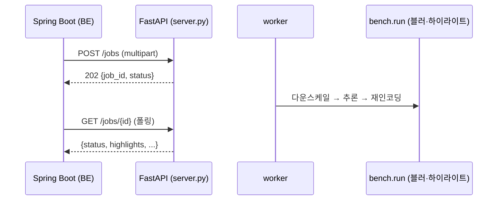
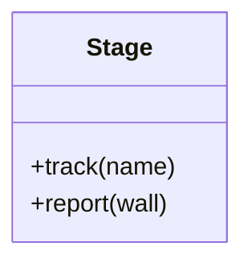

# PRD: {기능 이름}

> 티켓: MSG-{번호} (없으면 "미발행") · 작성일: {YYYY-MM-DD} · 작성: prd-writer
> 상태: 초안  <!-- 수명주기: 초안 → 검토됨(사용자 승인 시 게이트가 갱신) → 확정. 생성 시엔 항상 '초안' 단일값 -->

## 1. 문제 상황

지금 무엇이 안 되거나 불편한가. 사용자/팀이 겪는 실제 문제를 2~5문장으로.
실측 데이터가 있으면 근거로 붙인다 (예: "건당 처리 3분이라 시간당 17건이 상한이다 —
`results/MSG-151-report.md`").

## 2. 목적 · 목표

- **목적**: 이 기능이 왜 존재해야 하는가 (문제 상황과 연결, 1~2문장).
- **목표**: 완료 시 달성돼야 하는 것. 측정 가능하게.
  - 예: "BE가 폴링 응답만으로 얼굴·번호판 감지 건수를 알 수 있다"
- **비목표(스코프 제외)**: 이번에 하지 않는 것을 명시해 스코프 확장을 막는다.

## 3. 기능 요구사항

각 항목은 검증 가능한 문장으로 — 나중에 `--smoke` 체크나 실측 리포트의 판정 기준
하나로 떨어질 수 있어야 한다.

| ID | 요구사항 | 우선순위 |
|----|----------|----------|
| FR-1 | {행위자}는 {조건}에서 {행동}할 수 있다 | Must |
| FR-2 | ... | Must / Should / Could |

엣지 케이스·실패 시나리오도 요구사항이다 (예: "처리 실패한 잡은 상태 `FAILED` + `error`
메시지를 반환하고, 영상 엔드포인트는 409를 준다").

## 4. 비기능 요구사항

이 기능에 실제로 해당하는 항목만. 해당 없으면 행을 지운다.

| 분류 | 요구사항 |
|------|----------|
| 성능 | 예: 1080p 30초 기준 건당 3분 이내(dev EC2 t3.small 실측 기준 — macOS 측정 무효) |
| 프라이버시/정확도 | 예: 번호판 커버리지 95% 이상 유지 (미탐지는 프라이버시 사고 — recall 우선) |
| 계약 호환 | 예: BE가 소비 중인 응답 필드는 유지, 신규 필드는 optional |
| 운영 | 예: Docker 이미지 크기 증가 허용 범위, 롤백 가능성 |
| 라이선스 | 예: 신규 의존성 라이선스 — AGPL 경계가 BE로 새지 않는지 |

## 5. 시퀀스 다이어그램

주요 플로우 1~2개. mermaid `sequenceDiagram`.

## 6. 클래스 다이어그램

신규/변경되는 타입이 있을 때만. mermaid `classDiagram`. 기존 타입은 변경점만 표기.
단순 함수 추가면 이 절을 생략한다.

## 7. 변경 파일 목록

리서치(CLAUDE.md 현재 상태 + 실제 코드 확인) 기반으로 작성 — 추측 금지.

| 파일 | 변경 |
|------|------|
| `server.py` | 수정(무엇을) |
| `bench.py` | 수정(무엇을) |
| `results/MSG-{번호}-report.md` | 신규 실측 리포트 |

## 8. 미해결 질문

확정 못 한 결정 사항. 지어내지 않고 여기 남겨서 스펙 단계 전에 해소한다.

- [ ] 예: 감지 건수는 프레임 합산인가, 고유 객체 추정치인가?
