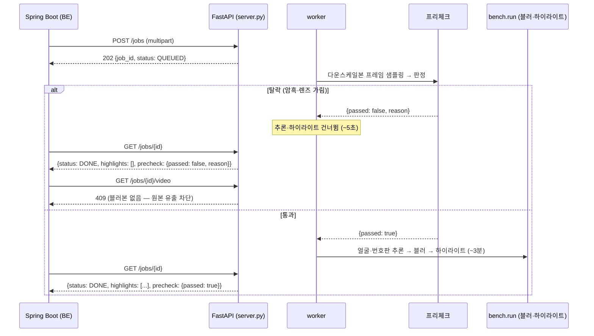

# PRD: 무의미 영상 프리체크

> 티켓: MSG-284 · 작성일: 2026-08-01 · 작성: prd-writer
> 상태: 검토됨  <!-- 수명주기: 초안 → 검토됨(사용자 승인 시 게이트가 갱신) → 확정 -->

## 1. 문제 상황

AI 처리는 건당 약 3분이 걸린다(dev EC2 t3.small 웜, 1080p 30초 `crowd` 187초 —
`results/ec2-aarch64-2core-crowd.json`). 이 3분이 시간당 처리량 20~23건의 상한을 결정하고,
병목은 AI 단일 워커 큐다(`results/MSG-151-report.md`).

그런데 **처리 가치가 없는 영상도 정확히 같은 3분을 쓴다.** 주머니 속 촬영이나 손가락으로
렌즈를 가린 영상에는 블러할 얼굴도 추천할 하이라이트도 없는데, 전 프레임에 대해 얼굴·번호판
추론을 돈다. 실측상 추론이 전체의 **87.4%**(얼굴 44.1% + 번호판 43.3%)이므로 낭비의 대부분이
여기다. 사용자 입장에서도 못 쓰는 영상이 3분을 기다린 뒤에야 지도에 올라간다.

소프트웨어로 추론 자체를 빠르게 하는 레버는 이미 소진됐다 — OpenVINO +5%(MSG-207),
프레임 스킵은 번호판 커버리지 46% 붕괴(MSG-207), imgsz 하향은 recall 붕괴(MSG-281).
`results/MSG-281-report.md`의 결론이 이 PRD의 출발점이다: **"건당 시간을 줄이려면 하드웨어이거나,
애초에 처리할 영상을 줄이는 쪽이다."**

## 2. 목적 · 목표

- **목적**: 처리 가치가 없음이 **명백한** 영상을 추론 시작 전에 걸러, 큐 점유 시간과 사용자
  대기를 없앤다. 애매한 영상은 거르지 않는다 — 오탐은 사용자가 멀쩡한 영상을 못 올리는 사고다.
- **목표**
  - 암흑·렌즈 가림 영상이 추론 없이 판정되고, 해당 잡의 총 처리 시간이 **5초 이내**로 끝난다
    (현재 ~187초).
  - 정상 영상 **오탐 0** — 커밋된 샘플 4종(`normal`·`crowd`·`plates`·`hires`)과 한국 클립
    (`kr-faces`·`kr-plates`) 전부 통과.
  - 판정 자체의 비용이 정상 영상 처리 시간의 **1% 미만**(≈2초 이내).
- **비목표(스코프 제외)**
  - **내용 기반 무의미 판정**(책상·의자·벽만 찍힌 영상). 밝고 흔들림 없는 정상 촬영이라
    픽셀 통계로는 안 걸리고 CLIP 같은 별도 모델이 필요하다 → 후속 티켓(§8).
  - 흔들림·초점·구도 품질 점수화.
  - 정지 화면 판정.
  - 탈락 영상에 대한 사용자 안내 문구·재업로드 유도 UX — BE/FE 몫.

## 3. 기능 요구사항

| ID | 요구사항 | 우선순위 |
|----|----------|----------|
| FR-1 | AI 서버는 얼굴·번호판 추론을 시작하기 전에 프리체크를 수행하고, 탈락 시 추론과 하이라이트 검출을 **모두 건너뛴다** | Must |
| FR-2 | 화면이 균일하게 어두워 피사체가 식별되지 않는 영상(암흑·렌즈 가림)은 탈락으로 판정한다 | Must |
| FR-3 | 야간 촬영처럼 **어둡지만 피사체가 식별되는** 영상은 통과한다 — 평균 밝기만으로 가르면 야간 거리 영상이 오탐된다 | Must |
| FR-4 | 잡 응답에 판정 결과를 담는다: `precheck: {passed: bool, reason: str\|null}`. 통과 시 `{true, null}` | Must |
| FR-5 | 탈락 잡의 `status`는 `DONE`이고 `highlights`는 빈 배열이다 — BE 매핑 변경 없이 배포 가능해야 한다 | Must |
| FR-6 | 탈락 잡의 `GET /jobs/{id}/video`는 결과 영상을 반환하지 않는다(409). 블러를 수행하지 않았으므로 원본이 나가면 프라이버시 사고다 | Must |
| FR-7 | 판정 근거 수치를 응답 또는 로그에 남겨, 배포 후 실제 업로드로 임계값을 사후 조정할 수 있다 | Should |
| FR-8 | 프리체크 자체가 실패하는 입력(영상을 열 수 없음 등)은 기존 `FAILED` + `error` 경로를 그대로 탄다 — 프리체크가 새로운 실패 모드를 만들지 않는다 | Must |

**BE 미적용 상태의 동작(중요)**: BE가 `precheck` 필드를 읽도록 고치기 전에는, 탈락 잡이
`DONE`으로 보이지만 영상 획득에서 409를 받는다. 즉 **BE 쪽에서 실패로 떨어진다** — 실질적인
큐 절감은 생기지만 사용자에게는 "처리 실패"로 보인다. 블러 안 된 원본이 공개될 경로는
어느 단계에서도 없다(FR-6). BE 대응 티켓은 §8 참조.

## 4. 비기능 요구사항

| 분류 | 요구사항 |
|------|----------|
| 성능 | 판정 비용 2초 이내, 탈락 잡 총 처리 5초 이내 (dev EC2 t3.small 실측 기준 — macOS 측정 무효) |
| 프라이버시 | 탈락 영상은 블러 처리본이 생성되지 않으며, 어떤 엔드포인트로도 원본이 나가지 않는다 |
| 정확도 | **오탐(정상 영상 탈락) 0이 우선**. 블러 요구사항과 방향이 반대다 — 블러는 미탐지가 사고지만, 프리체크는 오탐이 사고다. 놓친 무의미 영상은 그냥 3분 쓰고 끝난다 |
| 계약 호환 | 기존 응답 필드(`job_id`·`status`·`highlights`·`error`)는 그대로. `precheck`는 추가 필드이며 BE가 무시해도 기존 동작이 유지된다 |
| 운영 | 신규 의존성 없음 — `cv2`·`numpy`는 이미 있다. Docker 이미지 크기 변화 없음 |

## 5. 시퀀스 다이어그램

## 6. 변경 파일 목록

| 파일 | 변경 |
|------|------|
| `bench.py` | 프리체크 판정 함수 추가 + `--smoke`에 판정 검증(합성 암흑 영상 탈락 / 기존 합성 영상 통과) |
| `server.py` | 워커에서 추론 전 게이트 호출, 잡 응답에 `precheck` 필드, 탈락 시 video 409 |
| `results/MSG-284-report.md` | 임계값 실측 근거 — 어떤 영상이 탈락/통과하며 야간 영상이 왜 통과하는지 |
| `README.md` | "API (BE ↔ AI 계약)" 절에 `precheck` 필드 명시 |
| `CLAUDE.md` | 현재 상태 갱신 |

판정 로직을 `bench.py`에 둘지 `server.py`에 둘지, 다운스케일 전후 어디에 끼울지는 **구현 결정**이라
스펙 단계에서 확정한다.

## 7. 스펙 단계에서 실측으로 확정할 것

> **실측 완료 (2026-08-01)** — `results/MSG-284-report.md`. 판정은 **대비(std) 중앙값 10 미만
> 탈락**으로 확정. 샘플 14종 오탐 0 · 미탐 0. 아래 "평균 밝기 단독으로는 부족할 가능성이
> 높다"는 예상은 틀렸다(mean도 4.5배 마진으로 가른다) — 다만 마진이 가장 작아 std를 택했다.

숫자를 지금 정하면 근거 없는 상수가 된다. 스펙 착수 전 선행 실험으로 답을 만든다.

- **판정 지표와 임계값** — 렌즈 가림(균일하게 어두움)과 야간 촬영(어둡지만 가로등·간판으로
  대비가 큼)을 실제로 가를 수 있는 지표가 무엇인지가 이 기능의 성패다. 평균 밝기 단독으로는
  부족할 가능성이 높다. 실험 입력: 커밋된 샘플 4종 + 한국 클립 2종(전부 통과해야 함) +
  합성 암흑 영상 + **야간 실촬 클립**(오탐 검증용, 별도 확보 필요).
- **판정용 프레임 샘플링** — 몇 장을 어디서 뽑을지. 촬영 시작 직후에만 손이 가려진 영상을
  탈락시키면 오탐이므로, 균등 샘플의 과반 기준 같은 다수결이 필요하다.

## 8. 후속 작업 (이 PRD 밖)

- **BE 티켓** — BE가 `precheck.passed == false`를 읽어 "처리할 수 없는 영상"으로 안내한다.
  응답 필드 형태는 §3 FR-4로 확정됐고 BE는 읽기만 하면 된다. **BE 레포 경계를 넘으므로
  이 레포에서 진행하지 않는다** — BE 세션에서 티켓 발행.
- **내용 기반 무의미 판정** — CLIP zero-shot으로 "장소를 보여주는 영상인가" 판정.
  이미지 +~350MB, 프레임 10장 추론 1~2초, 오탐 시 멀쩡한 영상이 막힌다. 이번 스코프
  제외로 확정. 이 PRD의 프리체크가 실제 업로드에서 얼마나 걸러내는지 본 뒤 재평가한다.

## 9. 열려 있는 결정

없음. §7은 실험이 답하고, §8은 별도 티켓이다.

탈락 영상의 원본 보관은 기존 동작을 그대로 둔다 — 지금도 모든 잡의 원본이 `JOBS_DIR`에
남고 정리 로직이 없다. 디스크 정리는 이 기능 이전부터 있던 별개 문제다.
