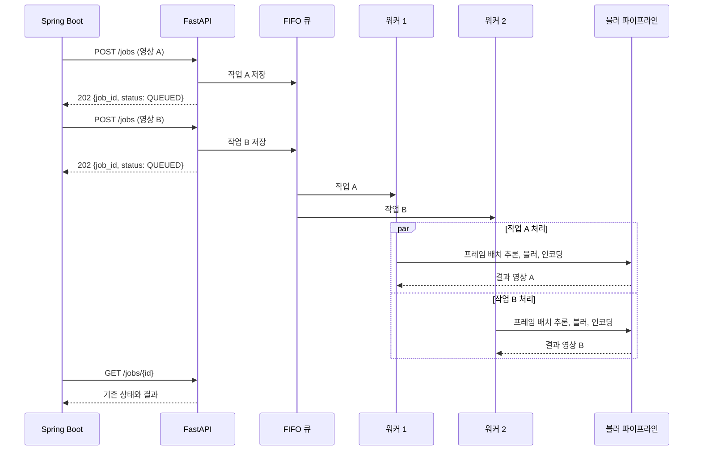

# PRD: AI 블러 처리량 개선

> 티켓: MSG-339 · 작성일: 2026-08-07 · 작성: prd-writer
> 상태: 검토됨  <!-- 수명주기: 초안 → 검토됨(사용자 승인 시 게이트가 갱신) → 확정 -->

## 1. 문제 상황

AI 서버는 현재 백엔드, PostgreSQL, Redis, Kafka와 같은 t3.small에서 실행된다. MSG-151의
동시 6건 실측에서 메모리 사용량은 1,480MB, 스왑 사용량은 606MB, load1은 7.13까지 올랐다.
작업은 단일 워커[^1]가 한 건씩 처리하므로 시간당 처리량도 약 20~23건에서 막힌다
(`results/MSG-151-report.md`).

기존 최적화 후보였던 OpenVINO, 프레임 건너뛰기, 입력 크기 축소는 속도 이득이 작거나
번호판 검출 정확도가 떨어져 기각됐다(`results/MSG-207-report.md`, `results/MSG-281-report.md`).
남은 선택지는 AI 자원 경합을 없애고, 쓰지 못하던 두 번째 vCPU에서 별도 작업을 실행하며,
여러 프레임을 묶어 추론 호출 횟수를 줄이는 방법이다.

## 2. 목적 · 목표

- **목적**: AI 블러 처리를 전용 서버로 분리하고 두 영상을 함께 처리해, 낮은 인스턴스 비용을
  유지하면서 사용자 대기 시간과 전체 처리 시간을 줄인다.
- **목표**
  - 전용 t3.small의 워커 1개, 배치 1개 기준보다 단일 영상 처리 시간을 20% 이상 줄인다.
  - 같은 기준보다 시간당 처리량을 1.7배 이상 늘린다.
  - 동시 처리 때 영상 한 건의 처리 시간 증가는 30% 이하로 유지한다.
  - 영상 6건을 동시에 요청해 전부 완료하고 작업 유실, OOM[^2], 컨테이너 재시작을 0건으로
    유지한다.
  - 얼굴과 번호판 검출 상자가 기존 기준 영상보다 누락되지 않게 한다.
  - CPU 크레딧[^3], 메모리, 스왑, 시스템 부하, 월 예상 비용을 실측 결과에 남긴다.
- **비목표(스코프 제외)**
  - GPU 또는 t3.small보다 비싼 인스턴스로 교체
  - Redis 등 외부 작업 큐와 재시작 후 작업 복구
  - AI 개발 환경과 운영 환경 분리
  - 운영 작업 우선순위와 환경별 큐 분리
  - OpenVINO, 프레임 건너뛰기, 입력 크기 축소 재검토
  - 백엔드와 AI 사이 HTTP API 계약 변경
  - 신규 라이브러리 도입

## 3. 기능 요구사항

| ID | 요구사항 | 우선순위 |
|----|----------|----------|
| FR-1 | AI 서버는 기존 `POST /jobs` 요청을 FIFO 큐[^4]에 넣고 기존 응답 형식을 반환한다 | Must |
| FR-2 | AI 서버는 서로 다른 작업 두 건을 동시에 처리하고 각 작업의 상태와 결과를 독립적으로 관리한다 | Must |
| FR-3 | 한 작업의 실패는 다른 작업의 처리와 상태를 바꾸지 않는다 | Must |
| FR-4 | 배치 추론[^5]을 사용해도 입력 프레임 순서와 출력 프레임 수를 유지하며 마지막 불완전 배치도 처리한다 | Must |
| FR-5 | 기존 `QUEUED`, `PROCESSING`, `DONE`, `FAILED` 상태와 영상 조회 동작을 유지한다 | Must |
| FR-6 | 배포 설정만으로 워커 1개와 배치 1개 상태로 되돌릴 수 있다 | Must |
| FR-7 | 배포 검증은 실제 영상 2건을 동시에 제출하고 두 작업의 완료와 결과 영상 재생을 확인한다 | Must |
| FR-8 | AI 서버의 8000 포트는 기존 백엔드 서버에서 오는 요청만 받는다 | Must |

## 4. 비기능 요구사항

| 분류 | 요구사항 |
|------|----------|
| 성능 | 전용 t3.small에서 같은 입력 영상으로 비교한다. 단일 처리 시간 20% 이상 감소, 처리량 1.7배 이상 증가, 동시 처리 시 건당 처리 시간 증가 30% 이하를 모두 만족해야 한다 |
| 프라이버시/정확도 | 기존 기준 영상과 비교해 얼굴과 번호판 검출 상자 누락이 없어야 한다. 성능을 위해 프레임을 건너뛰지 않는다 |
| 안정성 | 동시 6건이 모두 `DONE`이고 결과 영상이 재생돼야 한다. OOM, 컨테이너 재시작, 작업 유실은 0건이어야 한다 |
| 메모리 | 2GB 스왑을 구성하되 10초 간격의 swap-in 또는 swap-out이 3회 연속 발생하면 실패로 판정한다 |
| 비용 | 서울 리전 t3.small 온디맨드 요금인 시간당 0.026달러를 기준으로 한다. EBS, EIP, CPU 크레딧 추가 비용을 함께 기록한다 |
| 계약 호환 | 백엔드가 사용하는 HTTP 경로, 요청, 응답 필드를 바꾸지 않는다 |
| 인프라 | 서울 리전의 같은 VPC와 가용 영역에 Ubuntu 24.04, t3.small, gp3 20GB, 2GB 스왑으로 구성한다. EIP는 SSH 배포에 쓰고 8000 포트는 외부에 공개하지 않는다 |
| 운영 | 한 uvicorn 프로세스 안에서 작업 상태를 공유한다. 다중 uvicorn 프로세스로 메모리 큐와 상태 저장소를 나누지 않는다 |
| 라이선스 | 새 의존성을 추가하지 않고, AI 코드는 AGPL-3.0 저장소 밖으로 옮기지 않는다 |

## 5. 시퀀스 다이어그램

## 6. 변경 파일 목록

| 파일 | 변경 |
|------|------|
| `server.py` | 같은 프로세스 안에서 작업 두 건을 처리하고 워커 수를 배포 설정으로 제어 |
| `bench.py` | 얼굴과 번호판 모델의 프레임 배치 추론, 순서와 마지막 배치 보존 |
| `scripts/ec2-bench.sh` | 배치 크기별 단일 작업 시간과 검출 결과 비교 |
| `scripts/ec2-ai-load-test.sh` | 신규. 분리된 AI 서버의 동시 6건 처리량, 자원, 유실 여부 측정 |
| `scripts/ec2-deploy.sh` | 워커와 배치 설정 전달, 실영상 2건 동시 배포 검증 |
| `results/MSG-339-report.md` | 기준값, 단계별 실측값, 최종 설정과 비용 기록 |
| `results/MSG-339-*.json` | 반복 가능한 원시 측정 결과 |
| `README.md` | 검증된 처리 구조와 실행 설정 갱신 |
| `CLAUDE.md` | 현재 성능 기준과 기각한 설정 갱신 |

AWS의 EC2, EIP, 보안 그룹과 GitHub Actions 호스트 시크릿은 저장소 밖 운영 설정이다.
`.github/workflows/cd-dev.yml`은 기존 SSH 배포 흐름을 재사용하므로 변경하지 않는다.
MSG-151의 전체 BE 파이프라인을 재현하는 `scripts/ec2-load-test.sh`도 변경하지 않는다.

## 7. 단계별 검증

1. 전용 t3.small에서 워커 1개, 배치 1개로 기준값을 잰다.
2. 워커 1개에서 배치 2와 4를 비교해 단일 처리 시간과 메모리 사용량을 확인한다.
3. 워커 2개와 선택한 배치 크기로 동시 처리량, 건당 처리 시간, 검출 결과를 확인한다.
4. 영상 6건 부하에서 완료 수, 결과 파일, OOM, 재시작, 유실, 스왑 입출력을 확인한다.
5. 최종 설정으로 실제 영상 2건을 동시에 제출하는 배포 검증을 통과한다.

각 단계는 앞 단계 설정으로 즉시 되돌릴 수 있어야 한다. 한 기준이라도 실패하면 더 높은 동시성은
채택하지 않고 워커 1개와 배치 1개를 유지한다.

## 8. 스펙 단계에서 실측으로 확정할 것

- 배치 크기 2와 4 중 단일 처리 시간, 동시 처리량, 메모리 기준을 모두 만족하는 값
- 워커 2개가 스왑 연속 사용 없이 동시 6건 안정성 기준을 통과하는지 여부

두 항목은 스펙 단계의 EC2 실측으로 확정한다. 기준을 통과하지 못하면 하드웨어를 올리지 않고
통과한 가장 작은 설정을 채택한다.

## 9. 미해결 질문

없음. 배치 크기와 워커 수는 위 실측 기준으로 결정하며 추가 사용자 결정은 필요하지 않다.

[^1]: 워커는 큐에서 작업을 꺼내 실제 처리를 수행하는 실행 단위다. 현재는 하나뿐이라 요청이 여러 건 들어와도 순서대로 처리한다.
[^2]: OOM은 사용할 메모리가 부족해 운영체제나 런타임이 프로세스를 종료하는 상황이다.
[^3]: CPU 크레딧은 t3 계열이 기준 성능을 넘겨 CPU를 사용할 때 소모하는 자원이다. 부족분을 계속 사용하면 추가 비용이 생길 수 있다.
[^4]: FIFO 큐는 먼저 들어온 작업을 먼저 꺼내는 대기열이다. 동시에 실행해도 작업을 꺼내는 순서는 바꾸지 않는다.
[^5]: 배치 추론은 여러 프레임을 묶어 모델에 한 번에 넣는 방식이다. 호출 오버헤드를 줄이지만 메모리 사용량이 늘 수 있어 크기 2와 4를 비교한다.
